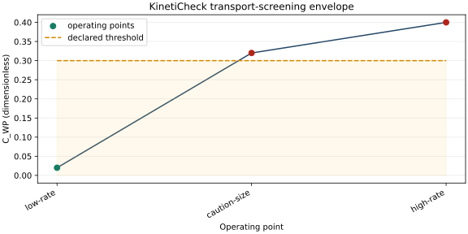

# KinetiCheck

**Explicit transport-limitation screening for heterogeneous catalytic kinetics.**

[](https://github.com/hdkim99/KinetiCheck/actions/workflows/ci.yml)
[](https://github.com/hdkim99/KinetiCheck/actions/workflows/macos.yml)
[](LICENSE)



KinetiCheck answers a deliberately limited question: *do the selected classical criteria detect a
significant internal/external heat- or mass-transfer limitation under the stated properties and
assumptions?* A passing screen is not proof of intrinsic kinetics.

## Why

Published checks often hide whether a rate was per catalyst mass, pellet volume, or bed volume;
whether diameter or radius was used; and whether a bulk concentration stood in for the pellet-surface
concentration. KinetiCheck makes those choices machine-readable and includes them in the export.

## Install

```bash
python -m venv .venv
source .venv/bin/activate
python -m pip install kineticheck
```

Until the first PyPI release, install from source with `python -m pip install .`. Plot export is optional:
`python -m pip install "kineticheck[plot]"`. The Tkinter GUI has no third-party GUI dependency, but the
Python installation must include Tk.

## 30-second example

```bash
kineticheck evaluate examples/operating_point.json
kineticheck batch examples/operating_points.csv --output results.xlsx
kineticheck plot examples/operating_points.csv --criterion C_WP --output envelope.svg
python -m kineticheck.gui
```

The included example gives `C_WP = 0.02`, `C_MM = 0.01`, `C_MH ≈ 0.02138`, and
`C_AH ≈ 0.01069`. Its inputs are pedagogical, not a real catalyst dataset.

## Scientific basis

| Screen | Implemented dimensionless form | Default comparison |
|---|---|---|
| Weisz–Prater internal mass | `C_WP = abs(r_obs,V) R_p² / (D_eff C_A,s)` | `C_WP < 0.30` |
| Mears external mass | `C_MM = abs(r_obs,V) R_p abs(n) / (k_c C_A,b)` | `C_MM < 0.15` |
| Mears external heat | `C_MH = abs(ΔH_r) abs(r_obs,V) R_p E_a / (h R_g T_b²)` | `C_MH < 0.15` |
| Anderson internal heat | `C_AH = abs(ΔH_r) abs(r_obs,V) R_p² E_a / (λ_eff R_g T_s²)` | `C_AH < 0.75` |

Each result records its equation, reference, assumptions, threshold, and convention. Thresholds may
be overridden explicitly. The detailed discussion in [Scientific definitions](docs/scientific-basis.md)
documents formulation differences rather than presenting a threshold as universal.

## Rate basis and units

Pint distinguishes, among others, `mol kgcat^-1 s^-1`, `mol gcat^-1 h^-1`, and
`mol m^-3 s^-1`, as well as `m`, `mm`, `µm`, `Pa`, `bar`, `J mol^-1`, and `kJ mol^-1`.
Mass-catalyst rates require an apparent pellet density. Bed-volume rates require a bed void fraction.
No implicit conversion between those bases is allowed.

## Validation

- Four-criterion hand calculation with exact intermediate values.
- Boundary, invalid physical input, mixed-unit, rate-basis, batch CSV/XLSX, CLI, export, and GUI
  lifecycle tests.
- Independent reproduction of the `3.910e-5` Mears external-mass value reported in the electronic
  supplement to RSC article `C5CY00934K`.

No suitably licensed full public operating-point dataset has yet been adopted; **real-data dataset
validation is pending**. The literature-point reproduction is not described as dataset validation.
See [validation](docs/validation.md).

## GUI and supported platforms

The GUI uses standard-library Tkinter/ttk. Qt, PyQt, PySide, and PyQtGraph are not dependencies.
The core/CLI import path does not import Tkinter or matplotlib. Matplotlib is imported only by the
plot command and uses `Agg`; the Tk GUI currently displays tabular results and therefore does not
select a matplotlib GUI backend.

- Python package metadata: 3.10–3.14; GUI smoke verified on Python 3.12 and 3.14
- Linux: scientific CI on the repository DGX ARM64 runner
- macOS: 15.7.7 hosted and 27.0 local, both on Apple Silicon; older versions are not yet verified
- Architectures: ARM64 is tested; Intel macOS remains not verified

Run `python -m kineticheck.gui --smoke-test` to exercise window creation, core calculation, JSON
export, close, and process exit. See [macOS notes](docs/macos.md).

## Limitations

- KinetiCheck screens supplied properties; it does not estimate diffusivity, transfer coefficients,
  conductivity, or reaction order with unreviewed correlations.
- Classical local criteria do not replace particle-size/flow-rate experiments, detailed pellet
  models, reactor energy balances, or uncertainty analysis.
- A bulk concentration may only stand in for `C_A,s` when the researcher explicitly accepts that
  assumption.
- Complex rate laws, strong product inhibition, multiphase wetting, non-spherical characteristic
  lengths, and coupled runaway behavior can lie outside the implemented screens.
- No confidence interval is fabricated from deterministic criteria.

## Documentation

- [Scientific definitions and references](docs/scientific-basis.md)
- [Batch schema](docs/batch-schema.md)
- [Validation record](docs/validation.md)
- [Naming and competitive audit](docs/naming-audit.md)
- [macOS and GUI policy](docs/macos.md)
- [Contributing](CONTRIBUTING.md)

KinetiCheck is research decision-support software, not process-safety certification software.
